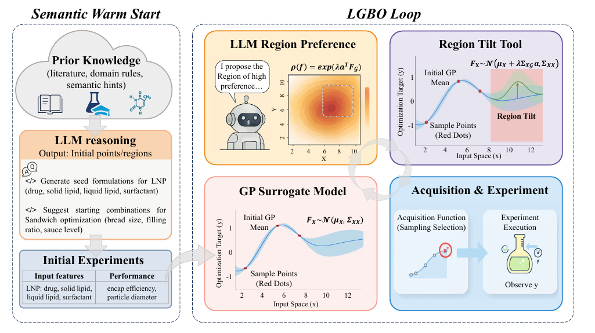
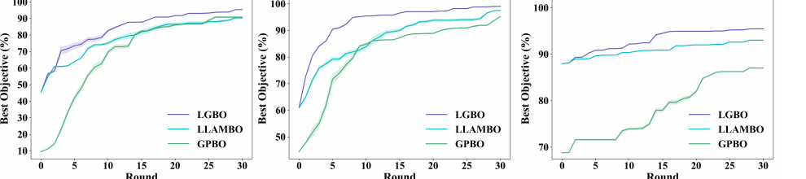
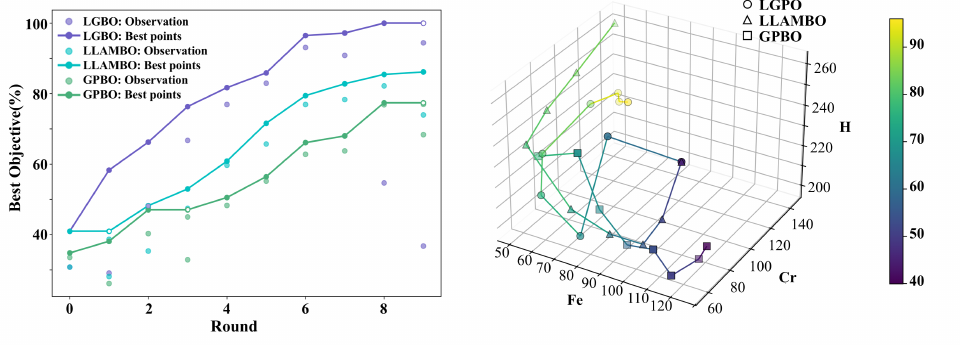

<h1 align="center">LGBO</h1>

<h3 align="center">LLM-Guided Bayesian Optimization for Scientific Discovery</h3>

<p align="center">
  <b>Continuous LLM preference guidance for Bayesian optimization through stable region-lifted surrogate updates.</b>
</p>

<p align="center">
  
  
  
  
</p>

<p align="center">
  <a href="#quick-start">Quick Start</a> •
  <a href="#how-lgbo-works">Method</a> •
  <a href="#results-at-a-glance">Results</a> •
  <a href="#running-experiments">Experiments</a> •
  <a href="#citation">Citation</a>
</p>

<p align="center">
  
</p>

---

## What is LGBO?

**LGBO** is a preference-guided Bayesian optimization framework that integrates Large Language Models (LLMs) into the BO loop. Instead of using LLMs only for warm-start initialization or direct candidate generation, LGBO converts LLM outputs into **point** or **region** preferences and incorporates them into the surrogate model through a **region-lifted preference mechanism**.

In plain terms: LGBO lets an LLM say *where the search should lean*, while the Bayesian optimizer still decides *which experiment to run next*.

This public research release includes:

- core LGBO preference-to-surrogate machinery;
- dry and wet experiment runners;
- toy-function dry benchmarks;
- offline smoke-test mode for checking the pipeline without an LLM call.

---

## Why LGBO?

| Challenge in scientific BO | LGBO design choice |
|---|---|
| Cold-start BO wastes expensive early experiments. | Use LLM semantic priors to warm-start the search. |
| Direct LLM candidate generation can be brittle. | Convert LLM output into a stable surrogate mean shift. |
| LLM guidance can be noisy or coarse. | Keep the acquisition function in control of final selection. |
| Scientific objectives are expensive and data-scarce. | Continuously inject preference guidance at every BO iteration. |

---

## How LGBO works

LGBO has one central idea: **region-lifted preference**.

An LLM proposes either a point or a region:

```text
[point,  [x1, x2, ..., xd], c]
[region, [[lb1, ..., lbd], [ub1, ..., ubd]], c]
```

where `c` is the LLM confidence. LGBO maps the suggestion into a lightweight preference functional:

```math
\rho(f) = \exp(\lambda a^\top F_G)
```

This lift is equivalent to a GP mean shift:

```math
F_X \sim \mathcal{N}(\mu_X + \lambda \Sigma_{XG}a, \Sigma_{XX})
```

The covariance is unchanged, so the BO loop remains stable and uncertainty-aware.

### Loop structure

1. **Semantic warm start**: query the LLM for initial points or regions using scientific context.
2. **Fit GP surrogate**: train the surrogate on observed experimental data.
3. **Ask for preference**: query the LLM for coarse point/region guidance.
4. **Apply region lift**: shift the surrogate mean according to the LLM preference.
5. **Acquire and evaluate**: use the acquisition function to select the next experiment.
6. **Repeat**: update the history and request fresh LLM guidance.

---

## Results at a glance

LGBO is designed to be more than a warm-start wrapper: the LLM remains part of the optimization loop throughout the run.

### Additional dry benchmarks

<p align="center">
  
</p>

LGBO also shows strong performance on noisy and practical engineering benchmarks such as HPLC, Cross-barrel, and Concrete.

### Wet-lab Fe-Cr electrolyte optimization

<p align="center">
  
</p>

In the Fe-Cr redox flow battery wet-lab experiment, LGBO reaches high-performing regions quickly and concentrates the search more effectively than GPBO and LLAMBO.

> Note: these figures summarize the paper experiments. This repository release currently focuses on the codebase, toy functions, and wet-planning runner.

---

## Quick start

### 1. Create the environment

We recommend using conda:

```bash
conda create -n lgbo python=3.13
conda activate lgbo
pip install -r requirements.txt
```

If your machine already has a compatible BoTorch environment, you can use that directly.

### 2. Run an offline smoke test

This checks the pipeline without calling the LLM:

```bash
python run_dry_once.py --func ackley --dim 3 --rounds 1 --batch-q 2 --offline
```

---

## API configuration

LGBO uses an LLM to produce point or region preferences. Set your API key before online runs.

On Windows CMD:

```bat
set API_KEY=your_key_here
```

On Windows PowerShell:

```powershell
$env:API_KEY="your_key_here"
```

On Linux/macOS:

```bash
export API_KEY=your_key_here
```

The default endpoint and model are configured in:

```text
api_config.py
```

For quick pipeline checks without calling the LLM, use:

```bash
--offline
```

---

## Running experiments

### Toy-function dry experiments

Offline smoke test:

```bash
python run_dry_once.py --func ackley --dim 3 --rounds 1 --batch-q 2 --offline
```

Online LLM-guided run:

```bash
python run_dry_once.py --func ackley --dim 6 --rounds 1 --batch-q 3
```

Supported toy functions:

```text
ackley, rastrigin, griewank, levy
```

### Wet experiment planning

The wet runner does **not** evaluate the objective. It consumes observed experimental data, asks the LLM for a point or region preference, applies LGBO, and outputs the next physical batch.

```bash
python run_wet_once.py --data-json examples/wet_input.example.json
```

Offline smoke test:

```bash
python run_wet_once.py --data-json examples/wet_input.example.json --offline
```

---

## Prompt overrides

Both runners support user-provided prompts:

```bash
--system-prompt "..."
--system-prompt-file path/to/system.txt
--user-prompt "..."
--user-prompt-file path/to/user.txt
```

User-provided prompts take priority over the defaults in:

```text
prompt.py
```

---

## Project structure

```text
.
|-- run_dry_once.py          # Dry experiment runner: toy functions
|-- run_wet_once.py          # Wet experiment planning runner
|-- lgbo_core.py             # LLM preference -> decide.py -> BO acquisition glue
|-- prompt.py                # Public prompt templates and parser
|-- boo.py                   # Region-lifted BO proposal logic
|-- decide.py                # Preference decision and guidance-strength mapping
|-- prior.py                 # Region-lifted prior / surrogate mean-shift tools
|-- prior_monte_carlo.py     # Monte Carlo acquisition sampler utilities
|-- fun/
|   |-- toy_fun.py           # Toy objective functions
|-- examples/
|   |-- wet_input.example.json
|   `-- dry_history.example.csv
|-- assets/                  # README figures
|-- requirements.txt
`-- README.md
```

---

## Current release notice

This repository is a research-code release for reproducing and testing the LGBO workflow.

A more packaged, pip-installable version with improved APIs and documentation is planned for **July 2026**.

---

## Citation

If you use this code in your research, please cite:

```bibtex
@inproceedings{yuanunleashing,
  title={Unleashing LLMs in Bayesian Optimization: Preference-Guided Framework for Scientific Discovery},
  author={Yuan, Xinzhe and Chen, Zhuo and Zhang, Jianshu and Xiong, Huan and Ye, Nanyang and Li, Yuqiang and Gu, Qinying},
  booktitle={The Fourteenth International Conference on Learning Representations}
}
```

---

## Relationship to SAIBO

This project represents one component of the SAIBO (Scientific Artificial Intelligence Bayesian Optimization) framework, which aims to unify LLMs, scientific agents, and Bayesian optimization for scientific discovery.

Future extensions and related projects will be released through SAIBO:

https://github.com/Xinzhe309/SAIBO-framework
